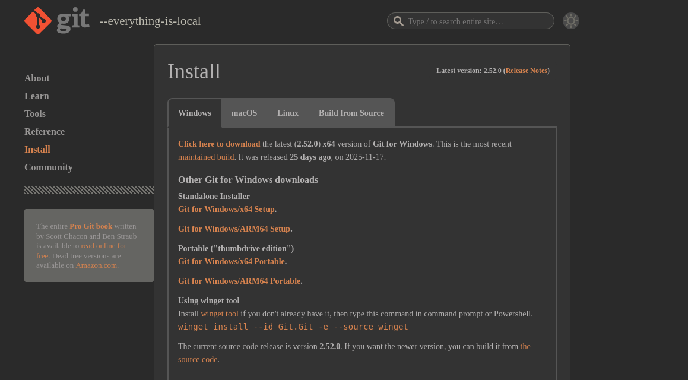

# **Git/Github ve Açık Kaynak Yazılım**

--- 

# Neden Git?

Git kullanmadan ekip çalışması yaptınız mı?
- Adları ‘final’, ‘final2’, ‘final_son_bu’, ‘final_son_son’ olan dosyalar
- Hiç bir dosyanın önceki haline geri dönme ihtiyacınız oldu mu?

---

# Neden Git?

Git kullanmadan ekip çalışması yaptınız mı?
- Adları ‘final’, ‘final2’, ‘final_son_bu’, ‘final_son_son’ olan dosyalar
- Hiç bir dosyanın önceki haline geri dönme ihtiyacınız oldu mu?


Git ve diğer versiyon kontrol sistemleri bu sorunlara çözüm bulmak amacıyla oluşturulmuştur.

---

# Git kurulumu

[https://git-scm.com/install](https://git-scm.com/install)


---

# Repository

Bir projenin tüm dosyalarının, geçmiş kayıtlarının (commit'lerin) ve ayarlarının saklandığı yerdir. 

- Mevcut bir klasörde repo oluşturmak için:
```bash
git init
```

- Bir repoyu bilgisayara klonlamak için:
```bash
git clone https://github.com/apache/superset.git
```

---

# Commit

Yaptığınız değişikliklerin kaydedilmiş bir anlık görüntüsü. Checkpoint ya da kayıtlı oyun gibi düşünebilirsiniz.

```bash
git commit -m "Commit mesajı"
```

---

# Branch

Belirli bir commiti işaret eden küçük bir işaretçidir. Her yeni commit ile ileri taşınır.

- Yeni bir branch oluşturmak için:
```bash
git branch msyavuz/feat/implement-sync
```

- Branch silme

```bash
git branch -d msyavuz/feat/implement-sync
```

---


---

# Merge

İki branch'i birleştirmenin en yaygın yolu. Yeni bir "merge commit" oluşturur.

```bash
git checkout main
git merge feature-branch
```

**Özellikleri:**
- Tüm geçmiş korunur
- Merge commit ile kim, ne zaman birleştirdi görülür
- Branch yapısı karmaşık olabilir

---

# Merge Örneği

```
main:     A---B---C---F (merge commit)
               \     /
feature:        D---E
```

Feature branch'teki D ve E commit'leri main'e merge edildiğinde F merge commit'i oluşur.

---

# Rebase

Branch'inizi başka bir branch'in üzerine "yeniden temellendirir". Commit'leri yeniden yazar.

```bash
git checkout feature-branch
git rebase main
```

**Özellikleri:**
- Temiz, lineer geçmiş
- Merge commit yok
- Public branch'lerde tehlikeli!

---

# Rebase Örneği - Önce

```
main:     A---B---C
               \
feature:        D---E
```

---

# Rebase Örneği - Sonra

```
main:     A---B---C
                   \
feature:            D'---E'
```

D ve E commit'leri C'nin üzerine yeniden yazılır (D' ve E' olur).

---

# Merge vs Rebase - Ne Zaman Merge?

- Public/paylaşılan branch'lerde
- Geçmişi korumak istediğinizde
- Takım çalışmalarında güvenli seçenek

---

# Merge vs Rebase - Ne Zaman Rebase?

- Local feature branch'lerde
- Temiz geçmiş istediğinizde
- Push etmeden önce main ile senkronize olurken

---

# Interactive Rebase

Rebase yaparken her commiti editleyerek devam etmenizi sağlar

```bash
git rebase -i HEAD~3  # Son 3 commit'i düzenle
```

Seçenekler:
- **pick**: Commit'i koru
- **reword**: Commit mesajını değiştir
- **squash**: Önceki commit ile birleştir
- **drop**: Commit'i sil
